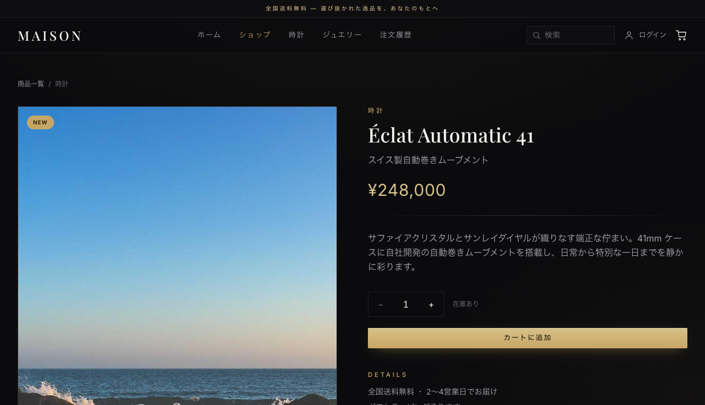

# MAISON — Luxury EC (PAYAPP)

ラグジュアリーブランドをイメージした、ダークテーマのECサイト（ポートフォリオ用個人開発）。
商品閲覧からカート、Stripe 決済、注文履歴までの購入体験を、拡張しやすい構成で実装しています。

## スクリーンショット




## 概要
- 黒基調 × シャンパンゴールドの世界観（デザインシステムを `globals.css` に集約）
- 商品一覧 / 詳細 / カート / 決済 / 注文履歴 / 会員（モック認証）まで一通りの EC フロー
- Stripe Checkout（テストモード）による実決済フロー

## 技術スタック
- **Next.js 16**（App Router / Turbopack / SSR・SSG）
- **React 19**
- **Tailwind CSS v4**（`@theme` でデザイントークンを定義）
- **Zustand**（状態管理・`persist` で localStorage 永続化）
- **Stripe**（Checkout Session による決済）
- **GraphQL**（graphql-yoga を Route Handler に載せた `/api/graphql`。型は GraphQL Code Generator で SDL から生成）
- 画像は `next/image`、フォントは `next/font`（Playfair Display / Inter）

## 主な機能
### 実装済み
- **トップ（ランディング）** — ヒーロースライダー / 新着 / カテゴリショーケース / ブランドプレッジ
- **商品一覧** — カテゴリ絞り込み・キーワード検索（名前 / 説明の部分一致）・件数表示・空状態
- **商品詳細** — 画像ギャラリー（サムネ切替）・数量指定でカート追加・関連商品
- **カート** — 追加 / 削除 / 数量増減（1 商品 1〜99 点）・小計 / 合計・localStorage 永続化（価格と商品名は常にカタログから引き直し）
- **決済** — Stripe Checkout へ遷移（GraphQL の `createCheckoutSession` で Checkout Session を作成。価格はサーバ側のカタログから決定）
- **GraphQL API** `/api/graphql` — 商品・カテゴリの取得、カートの見積もり、決済セッションの作成、決済の照会（下の「GraphQL API」）
- **決済結果** — 成功 `/success`（Stripe で支払い済みを確認できたときだけ、支払った内容で注文を履歴へ記録し、購入した分をカートから取り除く）/ キャンセル `/cancel`
- **注文履歴** `/orders` — 過去の注文を新しい順に表示
- **会員** `/login` `/account` — ログイン / ログアウト（※ ポートフォリオ用のモック認証）
- 共通ヘッダー（カート点数バッジ・検索・アカウント）/ フッター / レスポンシブ対応

### 今後の拡張候補
- バックエンド連携（商品 API・実認証 / NextAuth・注文の永続化）
- Stripe Webhook による注文確定・在庫管理
- お気に入り / レビュー / クーポン

## セットアップ

> **Node.js 22 を使ってください**（22.23.3 で lint・ビルド・テストを確認。Next.js 16 自体の要件は 20.9.0 以上）。

```bash
# 依存インストール
npm install

# 開発サーバー
npm run dev            # http://localhost:3000

# 本番ビルド & 起動
npm run build
npm run start

# テスト（決済まわりの純粋な関数と GraphQL API。Stripe には通信しません）
npm test               # node --test tests/*.test.mjs（Node 22 / 24 で確認）

# GraphQL の型を SDL から作り直す（lib/graphql/sdl.ts を変えたら実行してコミット）
npm run codegen
```

## 環境変数
`.env.example` を `.env.local` にコピーして設定してください。

| 変数 | 必須 / 任意 | 用途 |
| --- | --- | --- |
| `STRIPE_SECRET_KEY` | **必須**（決済を使う場合） | Checkout Session の作成（`/api/graphql`・`/checkout`）と決済確認（`/api/checkout/session`）。テストモードのキー `sk_test_...` を使ってください |
| `NEXT_PUBLIC_BASE_URL` | 任意（**本番では設定してください**） | 決済後の戻り先 URL と、OGP 画像を絶対 URL にする基準。未設定・不正な値のときは、戻り先はリクエスト URL の origin、OGP は Next.js の既定（ローカルでは `http://localhost:<port>`、Vercel では本番 URL）になります |

```
STRIPE_SECRET_KEY=sk_test_xxxx
# NEXT_PUBLIC_BASE_URL=https://your-domain.example
```

## 公開（Vercel）
Vercel の GitHub 連携でデプロイします。`vercel.json` は置いていません（Next.js は Vercel が自動で認識し、画像の許可ドメインは `next.config.ts` にあるため、追加の設定が要りません）。

1. Vercel にログインし、**Add New… → Project** でこの GitHub リポジトリを **Import** します（Framework Preset は Next.js のまま、Build Command・Output Directory も既定のまま）。
2. **Environment Variables** に次を設定します（名前は上の「環境変数」の表と同じです）。

   | 変数 | 設定する環境 | 値 |
   | --- | --- | --- |
   | `STRIPE_SECRET_KEY` | Production・Preview | Stripe のテストモードのキー `sk_test_...` |
   | `NEXT_PUBLIC_BASE_URL` | Production だけ | 本番の URL（例: `https://<プロジェクト名>.vercel.app`） |

   - `NEXT_PUBLIC_BASE_URL` を Preview にも入れると、プレビューで決済したときの戻り先が本番になります。Preview では未設定にしておけば、戻り先はそのプレビューの URL になります。
   - `NEXT_PUBLIC_` で始まる値はビルド時に埋め込まれるので、変えたら再デプロイしてください。
3. **Settings → Build and Deployment → Node.js Version** を **22.x** にします（ローカルと CI に合わせる）。
4. **Deploy** を押します。以後は `main` への push で本番に、プルリクエストではプレビューに自動でデプロイされます。

`main` への push とプルリクエストでは、GitHub Actions（`.github/workflows/ci.yml`）が lint・テスト・本番ビルドを Node 22 で実行します。ビルドは Stripe のキーが無くても通るので（キーはリクエスト時にだけ読みます）、CI には環境変数を設定していません。

## 決済の流れ
1. カートの「購入手続きへ」で、商品の **id と数量だけ** を GraphQL の `createCheckoutSession`（`POST /api/graphql`）に送ります。`POST /checkout` も同じ本体（`lib/checkout-session.mjs`）を使う REST の入口として残しています。
2. サーバは価格と商品名を `lib/catalog.mjs`（クライアントのストアと共有するカタログ）から引いて Checkout Session を作り、購入する id と数量を Session の metadata に持たせます。
   - 知らない id、1〜99 の整数でない数量（同じ id は合算してから判定）、16KB を超える本文は Stripe に送る前に弾き（GraphQL では `errors` / HTTP 413、`/checkout` では 400 / 413）、カートにその理由を表示します。ブラウザで価格を書き換えても請求額は変わりません。
   - 戻り先 URL は `NEXT_PUBLIC_BASE_URL`、無ければリクエスト URL の origin から作ります（`Origin` ヘッダーは使いません）。
3. Stripe の決済ページから `/success?session_id={CHECKOUT_SESSION_ID}` に戻ります。
4. `/success` は `GET /api/checkout/session?session_id=...` で Stripe に Session を問い合わせ、結果を 3 つに分けます。
   - **支払い済み**（`payment_status` が `paid`）: 確認ルートが metadata の id と数量をカタログに当てて作った注文（品目・単価・数量・合計）をそのまま履歴へ記録し、購入した品目と数量だけをカートから取り除きます（決済後にカートへ足した品は残ります。カートが空でも注文は記録されます）。
   - **未払い**（未払いの Session・`session_id` が無い / 形が不正）: 「決済を確認できませんでした」と表示し、何も記録しません。
   - **確認できなかった**（通信失敗・サーバエラー・10 秒の時間切れ・記録時の例外）: 「決済の確認が取れていません。二重に購入しないでください」と「もう一度確認する」を表示し、何も記録しません。サーバ側の Stripe への要求も 4 秒で打ち切り、再試行は 1 回までです。
   - 同じ `session_id` で注文を二重に記録しません（再読み込みしても 1 件のまま）。

価格の決定・Session からの注文作成・確認結果の判定・戻り先 URL の決め方・二重記録の防止は `lib/checkout.mjs` `lib/cart.mjs` `lib/site.mjs` の純粋な関数に分けてあり、`tests/` で検証しています。

> **注文履歴はブラウザごとです。** このデモにはサーバ側の保存先（DB）が無く、注文履歴は決済を確認したブラウザの localStorage にだけ記録されます。別のブラウザで同じ決済の戻り URL を開くと、そのブラウザにも記録されます。本番運用では Stripe Webhook と DB で注文を確定させる構成にしてください。

## GraphQL API

エンドポイントは `/api/graphql`（`POST` は `Content-Type: application/json`。`GET` でクエリを送るか、ブラウザで開くと GraphiQL が使えます）。スキーマは `lib/graphql/sdl.ts`、resolver は `lib/graphql/schema.ts` です。

商品をカテゴリとキーワードで絞り込む:

```graphql
query {
  products(category: "watches", q: "automatic") {
    id
    name
    price
    images
  }
}
```

カート（localStorage の id と数量）をサーバのカタログ価格で見積もる:

```graphql
query Quote($items: [CartItemInput!]!) {
  cartQuote(items: $items) {
    quote { total totalQuantity items { product { name price } quantity subtotal } }
    errors { code message }
  }
}
# variables: { "items": [{ "id": "1", "quantity": 2 }, { "id": "5", "quantity": 1 }] }
```

Stripe Checkout Session を作る（カートの「購入手続きへ」が使っているもの）:

```graphql
mutation Create($items: [CartItemInput!]!) {
  createCheckoutSession(items: $items) {
    url
    errors { code message }
  }
}
```

```bash
curl -s http://localhost:3000/api/graphql \
  -H 'Content-Type: application/json' \
  -d '{"query":"{ categories { slug label } }"}'
```

### 型の生成（codegen）

`npm run codegen` が `lib/graphql/sdl.ts` の SDL から、スキーマの型と resolver の型（`Resolvers`）を `lib/graphql/__generated__/types.ts` に出します（設定は `codegen.ts`）。生成物はコミットし、CI は `npm run codegen` のあとに差分が無いことを確かめます。SDL を変えたら `npm run codegen` を実行して、生成物も一緒にコミットしてください。

### 設計の要点
- **無状態**: サーバはカートも注文も保存しません（Vercel のサーバレスでは関数のメモリに状態を置けないため）。カートと注文履歴はこれまでどおりブラウザの localStorage にあり、API は送られた id と数量から毎回計算します。
- **価格はサーバが決める**: `CartItemInput` は `id` と `quantity` だけで、price を受け付けません。合計も Stripe に渡す金額も `lib/catalog.mjs` から引きます（`/checkout` と同じ関数を共有）。
- **決済の確認は REST のまま**: 成功ページは `GET /api/checkout/session` の HTTP ステータスで「支払い済み / 未払い / 確認できなかった」を分けて二重購入を防いでいるので、GraphQL には置き換えていません。GraphQL の `orderBySession` は読み取り用に足したものです。
- **入口の保護**: 本文は `/checkout` と同じ 16KB 上限、1 リクエストで実行できる Mutation は 1 つまで（エイリアスで Stripe へ多重に要求させない）、Stripe の例外文は返さない（yoga の maskedErrors）。
- テスト（`tests/graphql.test.mjs`）は handler を `new Request()` で直接呼び、偽の Stripe を差し込みます。サーバは起動せず、Stripe にも通信しません（Node 22 の型消去で `.ts` をそのまま読み込みます）。

## ディレクトリ構成
```
app/
  page.tsx              トップ（ランディング）
  product/page.js       商品一覧（検索・絞り込み）
  product/[id]/page.js  商品詳細
  cart/page.js          カート
  checkout/route.js     Stripe Checkout Session 作成 API（REST）
  api/graphql/route.ts  GraphQL API（graphql-yoga）
  api/checkout/session/route.js  決済確認 API（payment_status が paid か）
  success / cancel      決済結果
  not-found.js          404 ページ
  orders / login / account
components/              Header / Footer / ProductCard / CartItem / HeroSlider / SideMenu
store/                  productStore / cartStore / authStore / orderStore（Zustand）
lib/catalog.mjs         商品カタログ（クライアントとサーバで共有）
lib/checkout.mjs        価格の決定・Session からの注文作成・確認結果の判定（純粋な関数）
lib/checkout-session.mjs Checkout Session 作成の本体（/checkout と GraphQL で共有）
lib/graphql/            GraphQL の SDL・resolver・handler・ブラウザ用クライアント・生成した型
lib/cart.mjs            カートをカタログに合わせる・購入分を取り除く（純粋な関数）
lib/site.mjs            サイト設定・戻り先 URL / metadataBase の決め方（純粋な関数）
lib/stripe.js           Stripe クライアント（サーバ専用）
lib/format.js           金額・日付の整形ユーティリティ
tests/                  node --test のテスト
```

## 補足
- 認証は現状バックエンドを持たないデモ実装です（パスワード検証なし・localStorage 保持）。
- 商品カタログはモックデータです（`lib/catalog.mjs`）。
- 注文履歴はブラウザの localStorage に保存するデモ実装です（Webhook による注文確定は今後の拡張候補）。
- 完成度そのものより、設計・実装方針や UI/UX の考え方をご覧いただくことを目的としています。