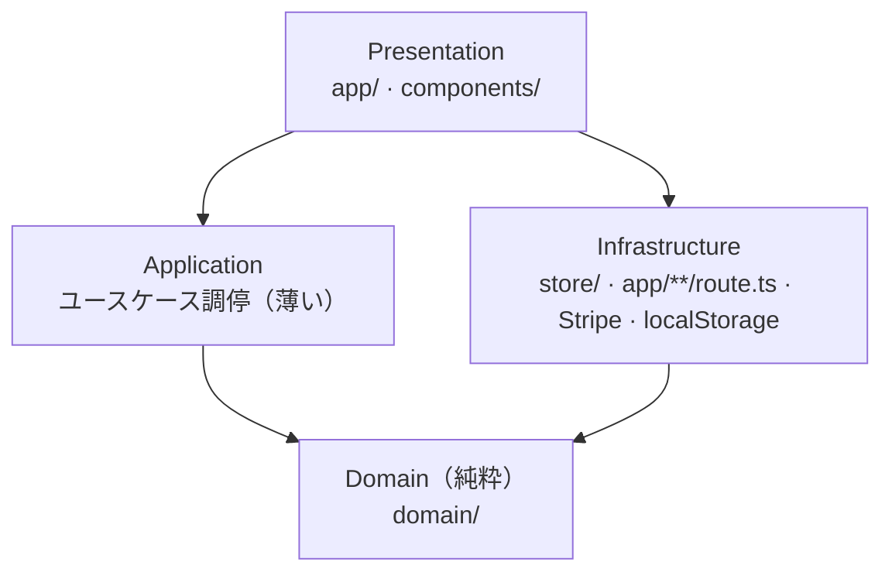

# PAYAPP アーキテクチャ

EC サイト PAYAPP の全体構造・レイヤリング・テスト戦略・CI/CD 方針をまとめる。
本ドキュメントが指す「あるべき構造」に向けて段階的に寄せていく。

## 目的

- ビジネスルール（在庫・価格・数量・注文確定など）を UI やフレームワークから切り離し、**テスト可能な純粋ドメイン**に集約する
- ドメイン駆動設計（DDD）で境界を明確にし、機能追加時の影響範囲を局所化する
- テスト駆動（TDD）で仕様をテストとして固定し、リグレッションを防ぐ

## レイヤリング

依存の向きは常に**内側（ドメイン）へ**。ドメインは外側（React / Next.js / Zustand / Stripe / localStorage）を知らない。



| レイヤ | 責務 | 現在の置き場所 |
| --- | --- | --- |
| Presentation | 画面・入力 | `app/`, `components/` |
| Application | ユースケースの調停（薄く保つ） | 当面は store 内 / 将来 `application/` へ切り出し可 |
| Domain | ビジネスルールの単一の真実。副作用なし | `domain/` |
| Infrastructure | 永続化・外部連携 | `store/`（Zustand+localStorage）, `app/**/route.ts`（Stripe） |

**依存ルール:** Domain は他のどのレイヤにも依存しない。時刻や ID 採番などの副作用は「ポート」（例: [`OrderClock`](../domain/ordering/order.ts)）として注入する。

## 境界づけられたコンテキスト（Bounded Context）

| コンテキスト | 責務 | 主なモデル |
| --- | --- | --- |
| **shared** | 全コンテキスト共通の値オブジェクト | `Money`, `Quantity` |
| **catalog** | 商品カタログと分類 | `Product`, `Category` |
| **cart** | カートの明細・数量・合計 | `Cart`（集約）, `CartItem` |
| **ordering** | 注文の確定とスナップショット | `Order`（集約）, `OrderClock` |

将来的に **inventory（在庫引き当て）** / **payment（決済ドメイン）** / **shipping（配送）** が独立コンテキストとして加わる想定。

### ディレクトリ構成

```
domain/
  shared/     Money / Quantity（値オブジェクト）
  catalog/    Product / Category
  cart/       Cart 集約・CartItem
  ordering/   Order 集約・OrderClock（副作用ポート）
```

各モジュールには仕様を固定する `*.test.ts` を同梱する。

## ストア → ドメインへの委譲（統合契約）

現在ビジネスルールは Zustand ストアに直接書かれている。これを段階的に `domain/` へ委譲する。
ストアは「ドメインの状態を持ち、UI へ配る」インフラ層に徹する。永続化は
`Cart.toJSON() / Cart.fromJSON()`、`Order.toJSON()` の形が既存の localStorage スキーマと一致するため、
**データ移行なしで差し替え可能**。

```js
// 例: store/cartStore.js（委譲後のイメージ）
import { Cart } from "@/domain/cart/cart";
import { Product } from "@/domain/catalog/product";

addItem: (product) =>
  set((state) => {
    const next = Cart.fromJSON({ items: state.items }).addItem(Product.create(product));
    return next.toJSON();
  }),

totalPrice: () => Cart.fromJSON({ items: get().items }).totalPrice().amount,
```

> 本セッションでは既存ストアは書き換えていない（別セッションが編集中のため）。
> 上記の委譲は、機能実装を集約する側で安全なタイミングに適用する。

## テスト戦略（TDD）

「テストピラミッド」を基本に、下ほど数多く・速く保つ。

1. **ドメイン単体テスト（最優先・大量）** — `domain/**/*.test.ts`。純粋関数なので高速・決定的。副作用は注入で排除（例: `OrderClock`）。**新しいルールはまずテストから書く。**
2. **コンポーネント/結合テスト（将来）** — `jsdom` + `@testing-library/react` を追加し、該当テスト先頭に `// @vitest-environment jsdom`。
3. **E2E（将来）** — Playwright 等でチェックアウト導線を検証。

実行:

```bash
npm test            # 一括実行（CI と同じ）
npm run test:watch  # 開発中のウォッチ
npm run test:coverage
npm run typecheck   # tsc --noEmit
```

## CI/CD 方針

### CI（本リポジトリで稼働）

[`.github/workflows/ci.yml`](../.github/workflows/ci.yml) が push / PR で以下を実行する:

`npm ci` → `lint` → `typecheck` → `test:coverage` → `build`

Node は 20 に固定。同一 ref の再 push で前の実行はキャンセルする。

### CD（設計のみ・雛形）

デプロイの**実装は集約側セッションが担当**する。本リポジトリには設計意図と無効化済み雛形
[`.github/workflows/deploy.yml`](../.github/workflows/deploy.yml) のみを置く。

設計上の想定:

- CI 成功を前提に、main への push / リリースタグで起動
- **プレビュー環境（PR）** と **本番環境（main）** を分離
- ホスティングは Next.js 標準の Vercel を第一候補（差し替え可能）
- `STRIPE_SECRET_KEY` / `NEXT_PUBLIC_BASE_URL` 等の秘匿値は **GitHub Secrets / 環境変数から注入**し、リポジトリには決してコミットしない

## 意思決定記録（ADR）

- [ADR-0001: DDD レイヤリングの採用](adr/0001-adopt-ddd-layering.md)
- [ADR-0002: テストランナーに Vitest を採用](adr/0002-testing-with-vitest.md)
